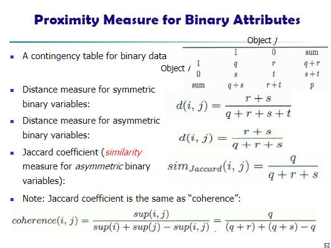

# **Getting to Know Your Data**
This includes data objects, attribute types, basic statistical descriptions, data visualization techniques, and measures of data similarity and dissimilarity.

### **1. Data Objects and Attributes**

**Data Objects** represent **entities** in a dataset (e.g., customers, patients, students). These are also referred to as ***samples***, ***examples***, ***instances***, ***data points***, ***objects***, or ***tuples***. 

"Data sets are made up of data objects... A data object represents an entity."*

**Attributes** describe **the characteristics of data objects** (e.g., customer_ID, name, address). Attributes are also known as ***dimensions***, ***features***, or ***variables***.

**Attribute types**
- **Nominal** $\rightarrow$ Categories or names (e.g., hair color, marital status).
- **Binary** $\rightarrow$ Two states (0 and 1). Can be symmetric (gender) or asymmetric (medical test result). 
- **Ordinal** $\rightarrow$ Meaningful order, but magnitude between values is unknown (e.g., size {small, medium, large}, grades, education levels). 

*"Values have a meaningful order (ranking) but magnitude between successive values is not known."*

**Numeric types - Quantitative values**
- **Interval** $\rightarrow$ Equal-sized units, order, but no true zero-point (e.g., temperature in Celsius, calendar dates).
- **Ratio** $\rightarrow$ Inherent zero-point, allowing for magnitude comparisons (e.g., temperature in Kelvin, length, monetary quantities).
- **Discrete** $\rightarrow$ Finite or countably infinite values (e.g., zip codes, words in a document).
- **Continuous** $\rightarrow$ Infinite values within a range (e.g., temperature, weight).

### **2. Types of data sets**
- **Record Data** - Most common, including:
    - *Relational records* 
    - *Data matrices*
    - *Document data (term-frequency vectors)*
    - *Transaction data*
- **Graph and Network Data** - Including
    - *World Wide Web*
    - *Social or information networks*
    - *Molecular structures*
- **Ordered Data** - Sequences of data, including:
    - *Video data (sequence of images)*
    - *Temporal data (time series)*
    - *Sequential data (transaction sequences)*
    - *Genetic sequence data*
- **Spatial/image/multimedia data**
    - *Spatial data: maps*
    - *Image data*
    - *Video data*

**Important characteristics of structured data**
- **Dimensionality - (Curse of dimension)** $\rightarrow$ Number of attributes and challenges arising from high dimensionality.
- **Sparsity - (Only presence counts)** $\rightarrow$ Only presence of data counts.
- **Resolution - (Patterns depen on the scale)** $\rightarrow$ Patterns depend on the scale.
- **Distribution - (Centrality and dispersion)** $\rightarrow$ Centrality and dispersion of data.

### **3. Statistical Descriptions of Data**

**Purpose**: To better understand the data, we have central tendency, variation, and spread.

**Central Tendency Measures**
- **Mean** $\rightarrow$ average value

    - Sample  $$\overline{x} = \frac{1}{n} \sum^n_{i= 1}x_i$$
    
    - Population $$\mu \ \frac{\sum x}N{} $$

- **Weighted Mean** $\rightarrow$ average value considering weights

$$\overline{x} = \frac{\sum_{i=1}^n w_ix_i}{\sum^n_{i=1}w_i}$$

- **Trimmed Mean** $\rightarrow$ mean after removing extreme values
- **Median** $\rightarrow$ middle value

- **Mode** $\rightarrow$ most frequent value

$$mean - mode = 3 \times (mean - median)$$

**Dispersion Measures**
- **Variance** $\rightarrow$  Measures of data spread around the mean

    - Sample $s$
        $$s^2 = \frac{1}{n - 1}\sum^n_{i=1}(x_i - \overline{x})^2 = \frac{1}{n - 1}\left[ \sum^{n}_{i= 1}x_i^2-\frac{1}{n}\frac{1}{n}\left(\sum^n_{i=1}x_i \right)^2 \right]$$
    - Population $\sigma$
        $$\sigma^2 = \frac{1}{N} \sum^n_{i=1}(x_i - \mu)^2 = \frac{1}{N}\sum^n_{i=1}x_i^2 - \mu^2$$

- **Standard deviation** $\rightarrow s$ (or $\sigma$) is the square root of variance

- **Quartiles** $\rightarrow$ Q1 (25th percentile), Q3 (75th percentile)
- **Inter-Quartile Range (IQR)** $\rightarrow$ Q3 - Q1
- **Five-Number Summary** $\rightarrow$ Min, Q1, Median, Q3, Max
- **Boxplot** $\rightarrow$ Visual representation of the five-number summary, with outliers
    - Data is represented with a box
    - The ends of the box are at the 1st and 3rd quartiles
    - The height of the box is IQR
    - The median is marked by a line with the box
    - Two lines outside the box extended to Min and Max is **Whiskers**
    - Points beyond a specified outlier threshold, plotted individually are **Outliers**

**Data Distribution**
- **Symmetric vs. Skewed Data** $\rightarrow$ understanding how data is distributed around the mean. 

Positively skewed data has a long tail on the right, while negatively skewed data has a long tail on the left.

    

**Specific Visualization Methods**
- **Boxplots** $\rightarrow$ display the five-number summary and outliers
- **Histograms** $\rightarrow$ show the distribution of frequencies

    

- **Quantile Plots** $\rightarrow$ show all of the data's behavior and unusual occurrences

    

- **Quantile-quantile (q-q) Plots** $\rightarrow$ compare quantiles of two distributions

    

- **Scatter Plots** $\rightarrow$ show relationships between two variables. "Provides a first look at bivariate data to see clusters of points, outliers, etc."

    

**Positive and Negative Correlated Data**

    

**Uncorrelated Data**

    

### **4. Data Visualization**

**Purpose**: 
- Gain insights into an information space by mapping data onto graphical primitives 
- Provide qualitative overview of large data sets
- Search for patterns, trends, structure, irregularities, relationships among data
- Help find interesting regions and suitable parameters for further quantitative analysis
- Provide a visual proof of computer representations derived

**Categorization of Techniques**

---

**Pixel-Oriented Visualization Techniques** 
$\rightarrow$ maps dimension values to pixels
- For a data set of $m$ dimensions, create $m$ windows on the screen, one for each dimension
- The $m$ dimension values of a record are mapped to $m$ pixels at the corresponding positions in the windows
- The colors of the pixels reflect the corresponding values

    

---

**Geometric Projection Visualization Techniques** 
$\rightarrow$ uses transformations and projections of the data. Some methods include:
- **Direct (Data) Visualization**

    

- **Scatterplot and scatterplot matrices**

    

- **Landscapes** $\rightarrow$ visualizes data as a perspective landscape. The data needs to be transformed into a (possibly artificial) 2D spatial representation which preserves the characteristics of the data

    

- **Parallel Coordinates** $\rightarrow$ displays each data item as a polygonal line intersecting axes representing attribute values

    

    

---

**Icon-Based** 
$\rightarrow$ represents data values as features of icons (e.g., Chernoff faces, stick figures)
- **Chernoff Faces** $\rightarrow$ uses facial features to represent data dimensions.

    

- **Stick Figures** $\rightarrow$ uses stick figures with varying limb angles/lengths to represent data dimensions

    

**Hierarchical** 
$\rightarrow$ partitions data into subspaces (e.g., dimensional stacking, tree-maps)

- **Dimensional Stacking** $\rightarrow$ partitions the attribute space into 2D subspaces

    

    

- **Worlds-within-Worlds**

    

- **Tree-Maps** $\rightarrow$ hierarchical partitioning of the screen

    

    

- **InfoCubes** $\rightarrow$ 3D visualization using nested semi-transparent cubes

    

- **Cone Trees** $\rightarrow$ 3D visualization of hierarchical information

    

- **Visualizing Complex Data and Relations**

    

### **5. Measuring Similarity and Dissimilarity**
- **Similarity** $\rightarrow$ numerical measure of how alike two data objects are. Higher values indicate greater similarity and often falls in the range $[0, 1]$
- **Dissimilarity (Distance)** $\rightarrow$ numerical measure of how different two data objects are. Lower values indicate greater similarity with minimum dissimilarity is often 0 and upper limit varies
- **Proximity** $\rightarrow$ a general term referring to either similarity or dissimilarity

**Data Matrix vs. Dissimilarity Matrix** $\rightarrow$ data matrix stores attribute values, while the dissimilarity matrix stores distances between data points

    

    

**Proximity Measures for Different Attribute Types**
- **Nominal** $\rightarrow$ simple matching

    

- **Binary** $\rightarrow$ contingency table, distance measures (symmetric and asymmetric), Jaccard coefficient

    

    

- **Numeric** $\rightarrow$ standardization (Z-score)

    

- **Minkowski Distance**  $\rightarrow$ a general distance measure that includes **Manhattan**, **Euclidean**, and **Supremum** distances as special cases
    - **Euclidean & Manhattan Distance** $\rightarrow$ numeric data comparison
    - **Jaccard Coefficient** $\rightarrow$ binary attribute similarity.
    

    

    

    

    

    - **Cosine Similarity** $\rightarrow$ text/document similarity. Measures the cosine of the angle between two vectors.

    

    

    

- **Ordinal** $\rightarrow$ rank-based methods

    

- **Mixed Type** $\rightarrow$ weighted formula to combine effects of different attribute types

    

### **Key Takeaways**

- Understanding the types of data and their attributes is crucial for effective data mining
- Statistical descriptions and visualizations provide insights into data characteristics
- Choosing appropriate similarity and dissimilarity measures is essential for tasks like clustering and classification
- This chapter lays the groundwork for data preprocessing, a critical step in the data mining process

This document provides a structured overview of fundamental concepts in data mining, focusing on understanding data before performing any analysis. Further chapters will build upon these concepts to explore preprocessing, pattern discovery, and advanced mining techniques.